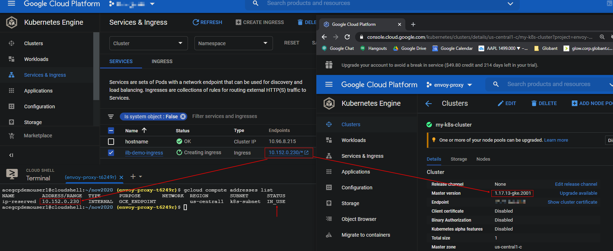

# GKE Ingress with Internal Private Static Reserved IP POC 

**Required GKE Master Version: 1.17.13-gke.2001**

**1.** Network Creation

```bash
gcloud compute networks create k8s-network \
  --bgp-routing-mode=global \
  --subnet-mode=custom

gcloud compute networks subnets create proxy-only-subnet \
  --purpose=INTERNAL_HTTPS_LOAD_BALANCER \
  --role=ACTIVE \
  --region=us-central1 \
  --network=k8s-network \
  --range=10.129.0.0/23

gcloud compute networks subnets create k8s-subnet \
  --region=us-central1 \
  --network=k8s-network \
  --range=10.152.0.0/23
```

**2.** POC Cluster Creation

```bash
gcloud container clusters create my-k8s-cluster \
  --cluster-version=1.17.13-gke.2001 \
  --enable-ip-alias \
  --zone=us-central1-c \
  --network=k8s-network \
  --subnetwork=k8s-subnet \
  --machine-type=g1-small \
  --num-nodes=1
```

**3.** Reserve Static IP

gcloud compute addresses create ip-reserved-name --region=us-central1 --subnet default --addresses 10.152.0.12

**The Reserved Private IP has to be in the Primary range of the subnet**

**4.** Deploy

```bash
# private-ip-ingress/

alias k="kubectl"

k apply -f svc.yaml
k apply -f deploy.yaml
k apply -f ingress.yaml
```

Goal:


